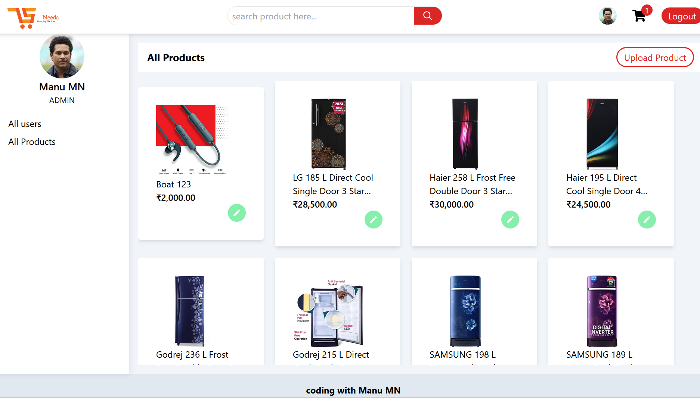

# eCommerce MERN Application

An eCommerce application built using the MERN (MongoDB, Express, React, Node.js,tailwind) stack.

# Screenshots:

Homepage

.Filter page

product Detail page

Cart Page

payment page

order-page

Admin-panel

## Features

- User authentication and authorization
- Product browsing and searching
- Shopping cart and checkout
- Order management
- Payment processing with Stripe
- Admin dashboard for product and order management

## Prerequisites

- Node.js
- MongoDB
- Stripe account

Technologies Used

    Frontend: React, Redux, Axios, Tailwind
    Backend: Node.js, Express
    Database: MongoDB
    Authentication: JWT
    Payment Processing: Stripe

## Installation

clone the repository
npm install
cd client
cd server
npm start / npm run dev
